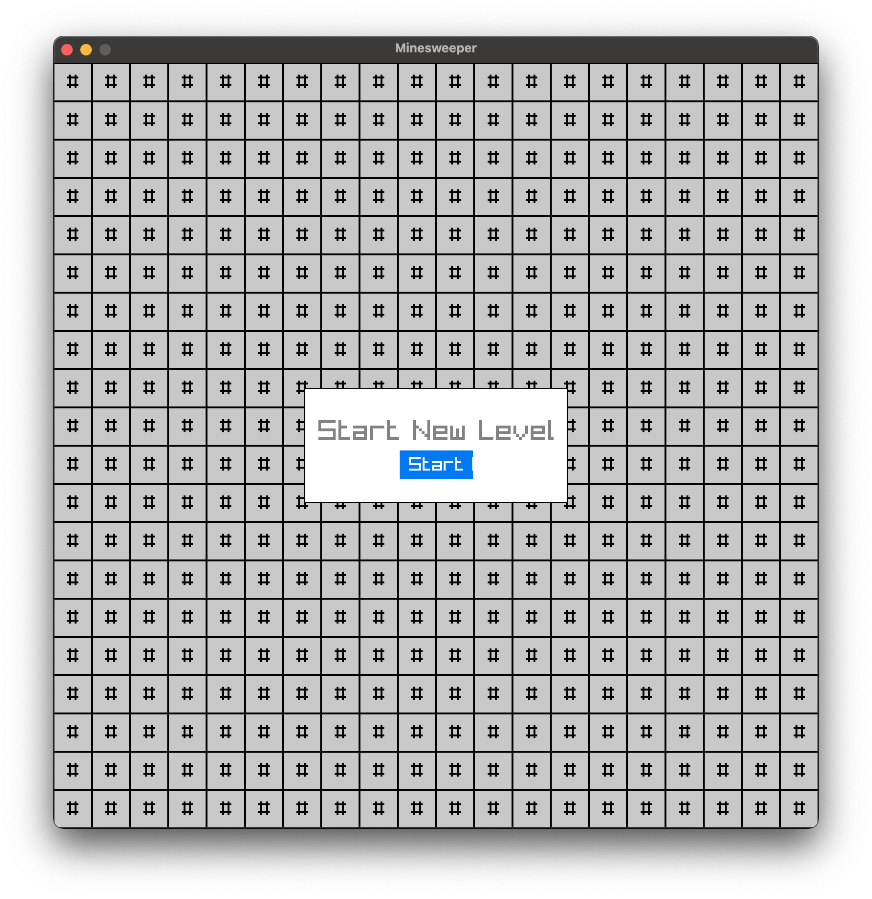

# Minesweeper Game

This is a classic Minesweeper game implemented in C using the raylib library. The game features a grid-based board where players must reveal tiles while avoiding hidden mines. 

## How to Play

1. **Objective**: The objective of the game is to uncover all tiles on the board that do not contain mines.
2. **Revealing Tiles**: Left-click on a tile to reveal its contents.
3. **Avoid Mines**: If you uncover a tile containing a mine, the game is over.
4. **Use Clues**: Use the numbers displayed on revealed tiles to determine the locations of mines.
5. **Winning**: You win the game by successfully revealing all safe tiles without detonating any mines.

## Controls

- **Left-click**: Reveal a tile.
- **Right-click**: Flag a tile as a suspected mine.
- **Left-click (on Game Over or Victory)**: Restart the game.

## Screenshots

<!--  -->

## How to Run

1. Clone the repository.
2. Install the required dependencies (raylib library).
3. Compile the source code.
4. Run the executable.

## Credits

- Developed by Abdokin
- Built with [raylib](https://www.raylib.com/)

## License

This project is licensed under the [MIT License](LICENSE).
